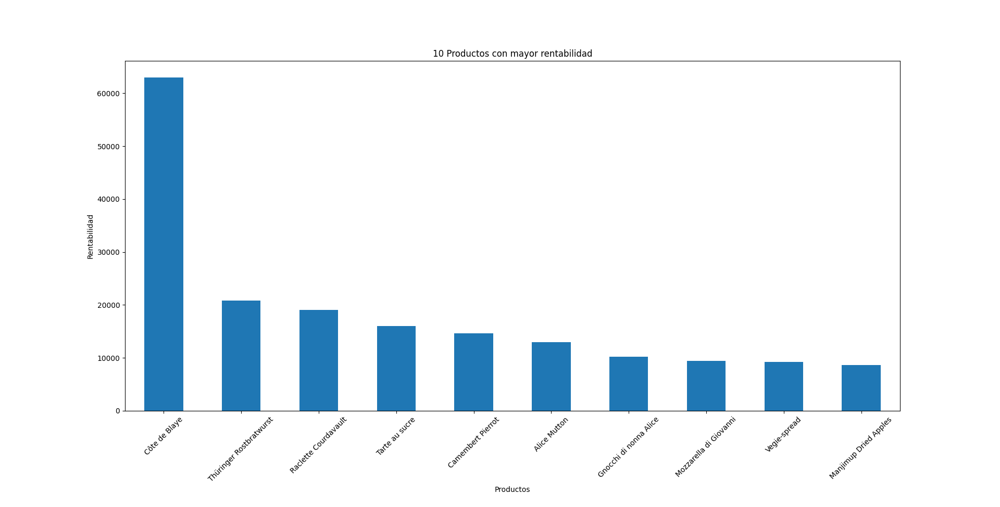
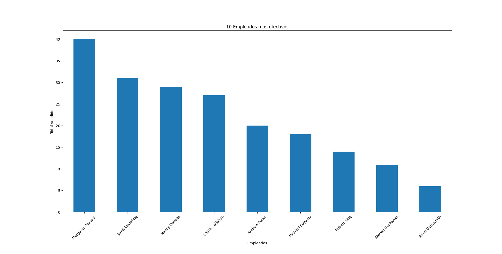
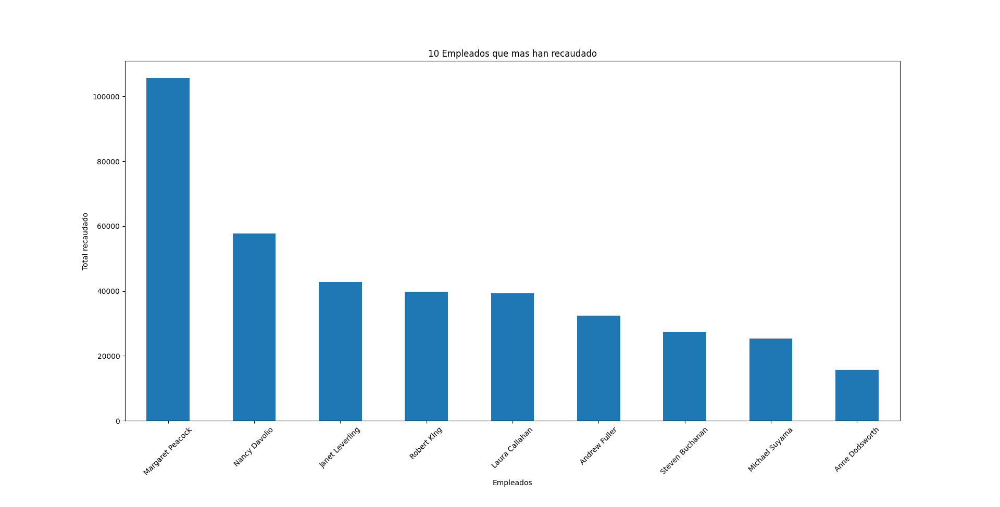

# SQLite + Python — Análisis de ventas (Northwind)

Proyecto simple para analizar ventas usando **Python**, **SQLite** y la base **Northwind**.

---

## 👀 ¿Qué hace?

- **Top 10 productos con mayor rentabilidad** (`Precio × Cantidad`).
- **Top 10 empleados más efectivos por número de ventas** (conteo de órdenes).
- **Top 10 empleados que más han recaudado** (suma monetaria).

Los resultados se presentan con **gráficos de barras** para una lectura rápida.

---

## 🗂️ Graficas
<figure>
  <figcaption>Top 10 productos con mayor rentabilidad 💵</figcaption>
  
</figure>

<figure>
  <figcaption>Top 10 empleados más efectivos (ventas).</figcaption>
  
</figure>

<figure>
  <figcaption>Top 10 empleados por recaudo total 💰.</figcaption>
  
</figure>
